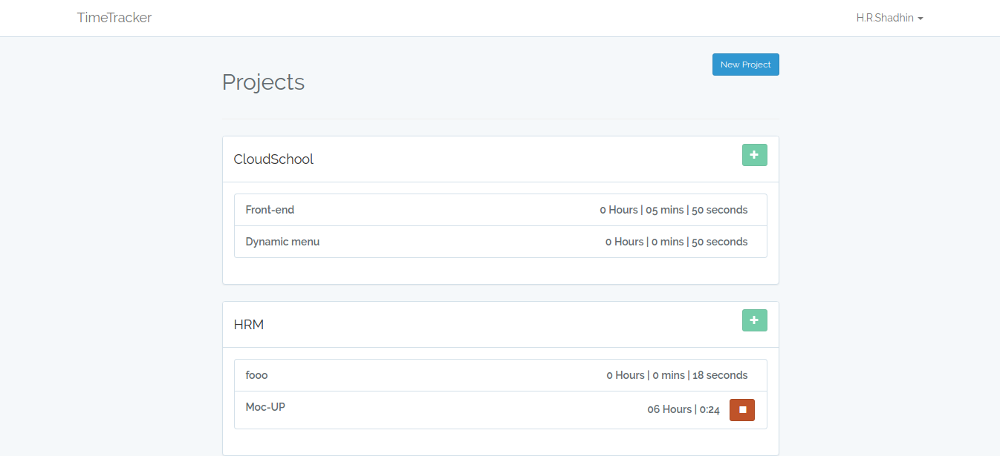

# TimeTracker
Its a simple time tracker for project works using laravel 5.5 and vueJS

## Installation and use
```
$ git clone https://github.com/hrshadhin/time-tracker.git
```
```
$ cd time-tracker
```
```
$ composer install
```
```
$ php artisan migrate
```
```
$ php artisan make:auth
```
```
$ npm install
```
```
$ npm run dev
```
```
$ php artisan serve
```
This should make your application available on this URL: http://127.0.0.1:8000. Visit the URL and create a new account. When you have created an account, you will be automatically logged in and you should see a “Dashboard”


# Screenshot

